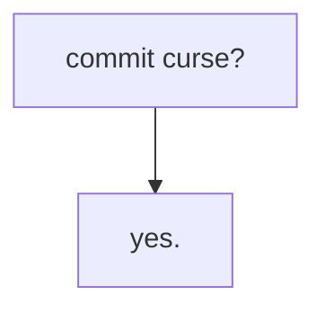

# coalpha's playground

Small, potentially cursed, and interesting artifacts of code.

$$
A = \text{I am going to commit Arson at UHS}\newline
G = \text{I have gasoline}\newline\newline
$$
$$
\frac{\frac{G\text{ true}}{A\text{ true}}\quad{\frac{G\text{ false}}{A\text{ false}}}}{(G\rightarrow A)\text{ true}\quad(\neg G\rightarrow\neg A)\text{ true}}
$$
