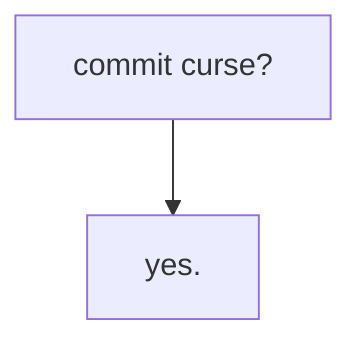

# coalpha's playground

Small, potentially cursed, and interesting artifacts of code.



```math
\displaylines{A = \text{I am going to commit Arson at UHS}\\ G = \text{I have gasoline}\newline\newline}
```
```math
\frac{\frac{G\text{ true}}{A\text{ true}}\quad{\frac{G\text{ false}}{A\text{ false}}}}{(G\rightarrow A)\text{ true}\quad(\neg G\rightarrow\neg A)\text{ true}}
```
